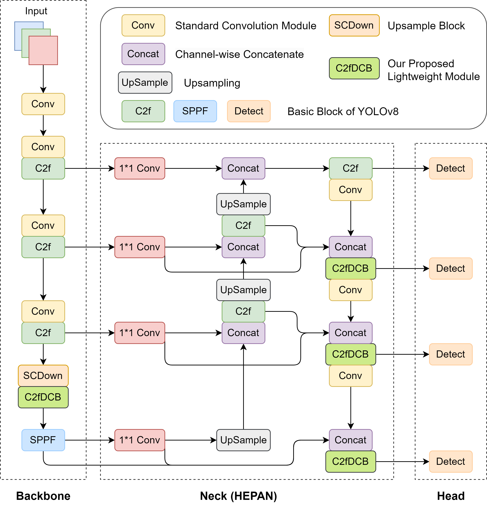

# SL-YOLO

SL-YOLO Reproduction Code

This repository only includes the preliminary reproduction of the SL-YOLO project. For more details and the original research content, please refer to the paper provided in the following link and contact the original authors. Please excuse any errors in the reproduction details.

[SL-YOLO: A Stronger and Lighter Drone Target Detection Model](https://arxiv.org/html/2411.11477v1)

Lastly, I would like to extend my gratitude once again to the authors of SL-YOLO for their contribution.

